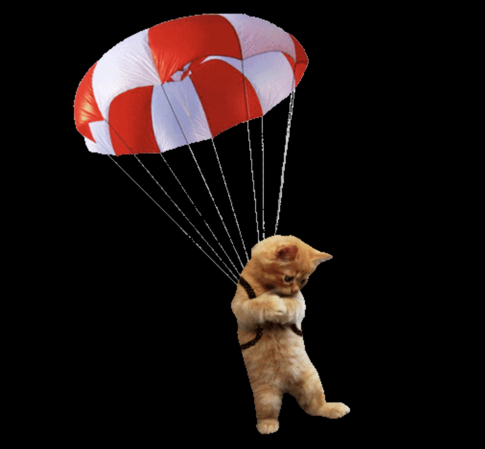

# Parallax Intro

## License

### 

### [MIT](https://opensource.org/licenses/MIT)

## Description

A basic website learning the fundamentals and application of the Parallax Effect through the npm package `react-spring`

By: [Vincent Toon](https://github.com/Vincenttoon)

## Table of Contents

- [Live Link](#live-link)

- [Installation](#installation)

- [Usage](#usage)

- [Contributors](#contributors)

- [Questions?](#questions)

## Live Link

[Live Link](https://parallaxintro-vwtd.vercel.app/)

## Installation

- Head to the repository to download or view this code: [Parallax Intro](https://github.com/Vincenttoon/parallax-intro)

## Usage

- Go to live link and watch the kitten float gently to safety

## Contributors

[Youtube link from Fireship as introduction to subject](https://www.youtube.com/watch?v=UgIwjLg4ONk)

## Questions?

Questions, comments, or concerns? Please Email me at:

- vincenttoon22@gmail.com
